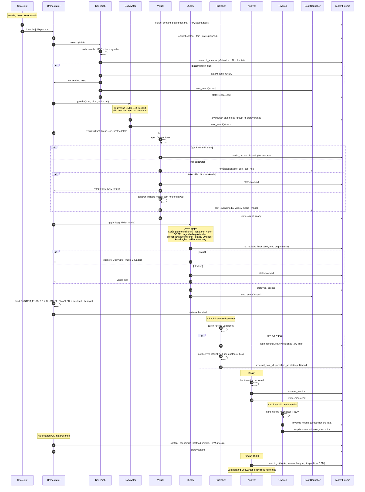

# ARCHITECTURE.md

**Versjon:** Fase 0-utkast, 2026-09-17 · **Status:** venter på godkjenning før koding

Les [MONETIZATION.md](./MONETIZATION.md) og [UNIT_ECONOMICS.md](./UNIT_ECONOMICS.md) først. Dette dokumentet forutsetter funnene der.

---

## 1. Plassering i repoet

Systemet legges under `social-engine/` i `Kricliff/sammen`. Det er et helt annet prosjekt enn Together-appen, som eier resten av repoet.

Det er en **bevisst midlertidig plassering**, valgt fordi det er billig å flytte nå og dyrt senere. `TODO(kristian):` si fra hvis dette heller skal være et eget repo — det er en fem-minuttersjobb i Fase 1 og en dagsjobb i Fase 4.

---

## 2. Mappestruktur

```
social-engine/
├─ MONETIZATION.md
├─ UNIT_ECONOMICS.md
├─ ARCHITECTURE.md
├─ docker-compose.yml              # Postgres + Redis + api + worker + dashboard
├─ .env.example                    # alle nøkler, ingen verdier
├─ package.json                    # npm workspaces
│
├─ config/                         # endres uten redeploy
│  ├─ strategy.yaml                # temaer, kanalvekter, frekvens, publiseringstider
│  ├─ voice.md                     # PÅ ENGELSK — tone, ordforråd, forbudte fraser, eksempler
│  ├─ brand.json                   # farger, fonter, logo, sikre marger per format
│  ├─ channels.yaml                # per kanal: aktiv, rate limit, autopublish-modus
│  └─ budgets.yaml                 # dag/uke/måned-tak i NOK
│
├─ prompts/                        # systemprompter, én fil per agent, leses ved kjøring
│  ├─ strategist.md   ├─ research.md    ├─ copywriter.md
│  ├─ visual.md       ├─ quality.md     ├─ engagement.md
│  ├─ analyst.md      └─ portfolio.md
│
├─ assets/                         # mediebibliotek for gjenbruk (Visual-agenten søker her først)
│
├─ packages/
│  ├─ core/           # domenetyper, Zod-skjemaer, tilstandsmaskin, marginberegning
│  ├─ db/             # Drizzle-skjema, migreringer, repositories
│  ├─ agents/         # én mappe per agent: kontrakt, verktøy, kjøring
│  ├─ publishers/     # én adapter per kanal + token-lager
│  ├─ economics/      # cost-ledger, revenue-ledger, margin, terskelsporing
│  ├─ queue/          # BullMQ-køer, jobbdefinisjoner, dead-letter
│  └─ observability/  # Pino-logging, agent-beslutningslogg, metrics
│
├─ apps/
│  ├─ api/            # Fastify: REST for dashboard + webhooks
│  ├─ worker/         # BullMQ-workers + scheduler (repeatable jobs)
│  └─ dashboard/      # Next.js 15, App Router, Tailwind, shadcn/ui — NORSK
│
└─ tests/
   ├─ unit/           # marginberegning, tilstandsmaskin, kostnadsføring
   ├─ contract/       # Zod-kontrakt per agent mot faste testinput
   └─ e2e/            # full dry-run-pipeline med mock-agenter
```

**Regelen fra oppdraget, håndhevet i struktur:** alt under `config/voice.md` og `prompts/` er på engelsk fordi det former publisert tekst. Alt i `apps/dashboard/`, alle logger, alle kodekommentarer og all dokumentasjon er på norsk.

---

## 3. Datamodell

PostgreSQL + Drizzle. Alle pengebeløp lagres som `numeric(14,4)` — **aldri float**. Alle tidsstempler er `timestamptz` i UTC; visning skjer i Europe/Oslo.

### 3.1 Innholdsmodellen

**`content_plan`** — Strategist-agentens ukesplan
| Kolonne | Type | Merknad |
|---|---|---|
| `id` | uuid PK | |
| `week_start` | date | mandag, Europe/Oslo |
| `theme` | text | |
| `channel` | channel_enum | |
| `format` | format_enum | `short_video`, `image_post`, `text_post` |
| `angle` | text | vinkelen briefen ber om |
| `target_rpm_nok` | numeric(10,4) | målet innlegget måles mot |
| `cost_cap_nok` | numeric(10,2) | **hard grense — Visual-agenten stopper ved overskridelse** |
| `scheduled_for` | timestamptz | |
| `rationale` | text | hvorfor Strategist allokerte hit |
| `created_at` | timestamptz | |

**`content_items`** — sannhetskilden. Ett rad = ett stykke innhold gjennom hele livsløpet.
| Kolonne | Type | Merknad |
|---|---|---|
| `id` | uuid PK | |
| `plan_id` | uuid FK → content_plan | |
| `state` | state_enum | se 4 |
| `channel` | channel_enum | |
| `format` | format_enum | |
| `language` | text | **alltid `en`** — en CHECK-constraint håndhever det |
| `script` | text | manus/brødtekst, engelsk |
| `caption` | text | |
| `hashtags` | text[] | |
| `variant` | smallint | 1 eller 2, for A/B |
| `ab_group_id` | uuid | binder de to variantene sammen |
| `media_urls` | text[] | |
| `idempotency_key` | text UNIQUE | **hindrer dobbeltposting** |
| `external_post_id` | text | plattformens ID etter publisering |
| `published_at` | timestamptz | |
| `dry_run` | boolean | true = alt kjørte, ingenting gikk ut |
| `created_at` / `updated_at` | timestamptz | |

**`research_sources`** — «ingen påstander uten kilde» gjort til en tabell
| `id`, `content_item_id` FK, `claim` text, `url` text, `publisher` text, `retrieved_at` timestamptz, `verified` boolean |

**`qa_reviews`** — Quality-agentens vetohistorikk
| `id`, `content_item_id` FK, `round` smallint, `verdict` (`approved`/`revise`/`blocked`), `checks` jsonb *(én rad per sjekk: språk, fakta, GDPR, helsepåstand, monetiseringsvennlighet, plagiat, kanalregler)*, `reasoning` text, `created_at` |

**`state_transitions`** — full revisjonslogg
| `id`, `content_item_id` FK, `from_state`, `to_state`, `agent` text, `reasoning` text, `created_at` |

**`agent_runs`** — hver agentkjøring, koblet til kostnad
| `id`, `content_item_id` FK (nullbar), `agent` text, `model` text, `input_tokens` int, `output_tokens` int, `cached_tokens` int, `duration_ms` int, `status`, `error` text, `created_at` |

### 3.2 Økonomimodellen — førsteklasses, som spesifisert

**`cost_events`**
| Kolonne | Type | Merknad |
|---|---|---|
| `id` | uuid PK | |
| `occurred_at` | timestamptz | |
| `content_item_id` | uuid FK, **nullbar** | null = fellesk./infrastruktur |
| `agent` | text | |
| `type` | cost_type_enum | `tokens`, `media_image`, `media_video`, `tts`, `storage`, `infra`, `api_call` |
| `quantity` | numeric(14,4) | tokens, sekunder, kreditter, GB |
| `unit_price_usd` | numeric(14,8) | |
| `amount_usd` | numeric(14,4) | |
| `fx_rate` | numeric(10,4) | USD/NOK på tidspunktet |
| `amount_nok` | numeric(14,4) | |

**`revenue_events`**
| Kolonne | Type | Merknad |
|---|---|---|
| `id` | uuid PK | |
| `occurred_at` | timestamptz | |
| `channel` | channel_enum | |
| `content_item_id` | uuid FK, **nullbar** | null = kanalinntekt som fordeles pro rata |
| `type` | revenue_type_enum | `ad`, `sponsor`, **`lead`** |
| `amount` | numeric(14,4) | |
| `currency` | text | |
| `fx_rate` | numeric(10,4) | |
| `amount_nok` | numeric(14,4) | |
| `source` | text | `youtube_analytics_api`, `meta_insights`, `manual` |
| `attribution` | attribution_enum | `direct` (plattformen oppga per innlegg) eller `pro_rata` (fordelt på visningsandel) |

> `type = 'lead'` er tillegget fra UNIT_ECONOMICS.md seksjon 6. Uten den kutter Portfolio-agenten LinkedIn som nullinntektskanal — som ville vært feil beslutning på riktig data.

**`content_metrics`** — tidsserie per innlegg per kanal
| `id`, `content_item_id` FK, `channel`, `measured_at`, `views` bigint, `engaged_views` bigint, `watch_time_seconds` bigint, `retention_pct` numeric, `likes`, `comments`, `shares`, `follows` |

**`content_economics`** — materialisert visning, oppdateres ved `measured` og `settled`
| `content_item_id` PK, `total_cost_nok`, `total_revenue_nok`, `views`, `rpm_nok`, `margin_nok`, `margin_pct`, `settled_at` |

**`budgets`**
| `id`, `period` (`day`/`week`/`month`), `period_start` date, `cap_nok`, `spent_nok`, `status` (`ok`/`warning`/`exceeded`), `updated_at` |

**`portfolio_decisions`**
| `id`, `decided_at`, `decision` (`scale_up`/`scale_down`/`pause`/`resume`/`explore`), `subject_type` (`channel`/`theme`/`format`), `subject` text, `evidence` jsonb *(n innlegg, snitt-RPM, margin, periode)*, `reasoning` text, `enacted_by` text, `overridden_by_owner` boolean |

**`monetization_thresholds`** — «vei til terskel» som eksplisitt delmål
| `id`, `channel`, `metric` (`subscribers`/`shorts_views_90d`/`watch_hours_12m`/`followers`/`watch_minutes_60d`), `required` bigint, `current` bigint, `measured_at`, `projected_reach_date` date |

### 3.3 Drift og sikkerhet

**`oauth_tokens`** — `channel`, `access_token` *(kryptert at rest)*, `refresh_token` *(kryptert)*, `scopes` text[], `expires_at`, `last_refreshed_at`. Varsel 7 dager før `expires_at`.

**`system_flags`** — kill switch. `key` (`SYSTEM_ENABLED`, `CHANNEL_ENABLED:youtube`, …), `value` boolean, `changed_by`, `changed_at`.

**`notifications`** — `type`, `severity`, `payload` jsonb, `sent_at`, `acknowledged_at`.

### 3.4 Marginberegningen

Ren funksjon i `packages/core`, uten I/O, med enhetstester på kjente tall:

```ts
margin_nok  = sum(revenue_events.amount_nok) - sum(cost_events.amount_nok)
rpm_nok     = (sum(revenue_events.amount_nok) / views) * 1000
margin_pct  = margin_nok / sum(cost_events.amount_nok)
```

Pro rata-fordeling når plattformen kun oppgir kanalinntekt for en periode:

```ts
andel_i = visninger_i / sum(visninger for kanalen i perioden)
inntekt_i = kanalinntekt_periode * andel_i
```

Kantene som **skal** ha egne tester: null visninger (RPM er udefinert, ikke 0 — returner `null`), null kostnad (margin_pct udefinert), inntekt som ankommer etter `settled` (åpner raden på nytt), og valutakurs som endrer seg mellom kostnads- og inntektsføring.

---

## 4. Tilstandsmaskinen

```
planned → researched → drafted → visual_ready → qa_passed → scheduled → published → measured → settled
```

Sideutganger:

| Tilstand | Betydning |
|---|---|
| `needs_review` | Research fant ingen kilde til en påstand. Venter på eier. |
| `revising` | Quality sa `revise`. **Maks 2 runder**, så `blocked`. |
| `blocked` | Quality sa `blocked`, eller budsjett-/kostnadstak truffet. Varsler eier. |
| `failed` | Publisering feilet endelig etter retry. Havner i dead-letter. |
| `cancelled` | Eier avlyste, eller kill switch var av da turen kom. |

Regler som håndheves i kode, ikke i konvensjon:

- Overgang skjer kun gjennom `transition(item, to, agent, reasoning)`. Den skriver `state_transitions` i samme transaksjon som tilstandsendringen. Ingen agent får sette `state` direkte.
- **`settled` krever at både kostnad og inntekt er registrert.** Et innlegg uten kostnadstall kan ikke nå `settled`. Det er oppdragets «ingen innlegg uten kostnadstall», håndhevet av tilstandsmaskinen.
- `published` er idempotent på `idempotency_key`. Andre forsøk er en no-op som returnerer eksisterende `external_post_id`.
- Timeout per tilstand. Et innlegg som blir hengende, plukkes opp av en reaper-jobb og flyttes til `failed` med begrunnelse.

---

## 5. Sekvens for én innleggssyklus



---

## 6. API-scopes som må søkes om

Dette er listen fra oppdraget. Det kritiske er kolonnen lengst til høyre: **hvor lang tid det tar før scopet faktisk er brukbart.**

### 6.1 YouTube (Google Cloud Console → OAuth consent screen)

| Scope | Til hva | Merknad |
|---|---|---|
| `.../auth/youtube.upload` | Laste opp Shorts | Sensitivt scope |
| `.../auth/youtube.readonly` | Lese kanal- og videodata | Sensitivt |
| `.../auth/yt-analytics.readonly` | Visninger, retensjon, følgere | Sensitivt |
| `.../auth/yt-analytics-monetary.readonly` | **Faktisk inntekt per video** | Sensitivt — dette er scopet hele Revenue-agenten hviler på |

**Ledetid:** Sensitive scopes krever verifisering av OAuth-samtykkeskjermen hos Google. For én egen kanal kan du kjøre i testmodus med deg selv som testbruker og slippe unna — men testmodus gir refresh-tokens som **utløper etter 7 dager**. Det er en reell drifts­smerte og må avklares før Fase 3.

### 6.2 TikTok (TikTok for Developers)

| Scope | Til hva |
|---|---|
| `user.info.basic` | Kontoinfo |
| `video.upload` | Laste opp til utkast |
| `video.publish` | **Direktepublisering** |
| `video.list` | Lese egne videoer for metrics |

**Ledetid:** Klienten må gjennom **TikToks revisjon** før noe kan publiseres offentlig. Uten revisjon er alt `SELF_ONLY`, og kontoen må være privat. Se MONETIZATION.md 3.3. Dette er en forretningsgjennomgang hos TikTok, ikke en teknisk bryter.

### 6.3 Meta (Instagram + Facebook)

| Scope | Til hva |
|---|---|
| `instagram_business_basic` | Kontoinfo |
| `instagram_business_content_publish` | Publisere Reels og feed |
| `instagram_manage_insights` | Metrics |
| `pages_manage_posts` | Publisere til Facebook-side |
| `pages_read_engagement` | Kommentarer, reaksjoner |
| `read_insights` | Side- og videoinnsikt |
| `business_management` | Knytte side og IG-konto |

**Forutsetninger:** Instagram må være **Business- eller Creator-konto**, koblet til en Facebook-side Kristian er admin for. Personlige kontoer har ingen programmatisk publisering.

**Ledetid:** App Review, **5+ virkedager per innsending**, og avvisning er vanlig første gang.

**Rate limit:** Dokumentasjonen motsier seg selv (50 vs. 100 per 24 t). Vi hardkoder ingenting — Publisher-adapteren spør `GET /<IG_ID>/content_publishing_limit` før hver publisering.

### 6.4 LinkedIn

| Scope | Til hva |
|---|---|
| `openid`, `profile` | Identitet |
| `w_member_social` | **Publisere som medlem** |
| `r_member_social` | Lese egne innlegg og engasjement — **begrenset scope** |

**Ledetid:** `w_member_social` krever tilgang til Community Management API, som må søkes om og begrunnes. `r_member_social` er strengere. Regn med at metrics fra LinkedIn må hentes manuelt i starten.

### 6.5 Oppsummert ledetid

| Kanal | Kan kode mot | Kan publisere offentlig |
|---|---|---|
| YouTube | Umiddelbart (testmodus) | Umiddelbart for egen kanal, med 7-dagers token-smerte |
| LinkedIn | Etter API-søknad | Etter godkjenning |
| Meta | Etter App Review | 5+ virkedager per runde |
| TikTok | Umiddelbart (privat) | **Kun etter TikToks revisjon** |

Dette er hele begrunnelsen for kanalrekkefølgen i Fase 3: **YouTube først, LinkedIn deretter, Meta tredje, TikTok sist.** Det sammenfaller med inntektsprioriteringen i MONETIZATION.md seksjon 7, noe som er beleilig, men ikke tilfeldig — det er de samme plattformene som er restriktive på begge sider.

---

## 7. Kø og planlegging

BullMQ over Redis, ikke cron, av grunnene oppdraget nevner: retry, dead-letter og observabilitet.

| Kø | Concurrency | Retry | Merknad |
|---|---|---|---|
| `strategy` | 1 | 2 | Repeatable: mandag 06:00 Europe/Oslo |
| `research` | 3 | 3, eksponentiell | Batch-API der det går |
| `copywrite` | 3 | 2 | |
| `visual` | 2 | 2 | Dyrest — lav concurrency, hardt kostnadstak |
| `qa` | 4 | 2 | |
| `publish` | 1 per kanal | 5, eksponentiell | Serialisert per kanal for å respektere rate limit |
| `metrics` | 2 | 3 | Daglig |
| `revenue` | 1 | 3 | Fast intervall, tåler plattformetterslep |
| `economics` | 1 | 2 | Fredag 15:00 + daglig |

Alle køer har dead-letter. En jobb som ender der, varsler eier — den forsvinner ikke i stillhet.

---

## 8. Styring og sikkerhet

| Krav | Hvordan |
|---|---|
| **Kill switch** | `system_flags`. Sjekkes i `publish`-jobben, ikke bare i dashboardet. Av = alt køes, ingenting publiseres. |
| **Rate limits** | `config/channels.yaml`, håndhevet i Publisher. Hard stopp, ikke advarsel. |
| **Budsjettstopp** | Cost Controller skriver `budgets`. Ved 80 %: varsel. Ved 100 %: `strategy`, `research`, `copywrite` og `visual` pauses. Køen tømmes ferdig. |
| **Dry-run** | `DRY_RUN=true` er **default ved første oppstart**. Hele pipelinen kjører med reelle kostnadstall, Publisher skriver resultatet uten å kalle plattformen. |
| **Revisjonslogg** | `state_transitions` + `agent_runs` + `qa_reviews` + `research_sources` + `cost_events` + `revenue_events`. Ethvert innlegg kan spores fullt tilbake. |
| **Angre** | Publisher-adapterne implementerer `delete`/`unpublish`. Ett klikk i dashboardet. |
| **Sekreter** | `.env` lokalt, Doppler/Vault i prod. `oauth_tokens` krypteres at rest. **Ingen nøkler i kode, noen gang.** |
| **Varsling** | E-post + push ved `blocked`, API-feil, token-utløp om 7 dager, budsjettvarsel, negativ margin to uker på rad, eller brått inntektsfall. |

---

## 9. Åpne spørsmål som påvirker arkitekturen

Disse tre må besvares før Fase 1 lukkes. Resten kan avgjøres underveis.

1. **Autopubliser eller ett godkjenningstrykk?** Se UNIT_ECONOMICS.md 6.2. Systemet bygges med `AUTOPUBLISH_MODE` per kanal uansett, så dette låser ingenting — men det avgjør hva som er default, og hvor mye dashboardets kø-visning må gjøre.
2. **Ren Shorts-strategi, eller hybrid med langformat?** Se UNIT_ECONOMICS.md 4.2. Hybrid endrer Strategist-agentens formatvalg og legger til en langformat-produksjonsvei i Visual-agenten. Vesentlig forskjell i Fase 2.
3. **Direkte modell-API eller Everygen for video?** Anbefalingen er direkte (3–4x billigere og uten 200-kredittaket). Det avgjør hvilken leverandøradapter Visual-agenten bygges mot først.
